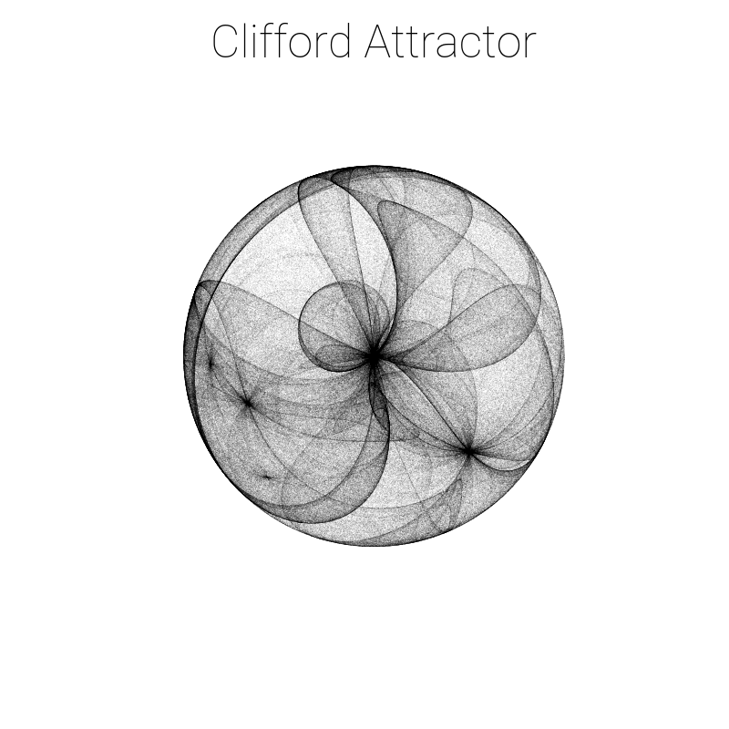
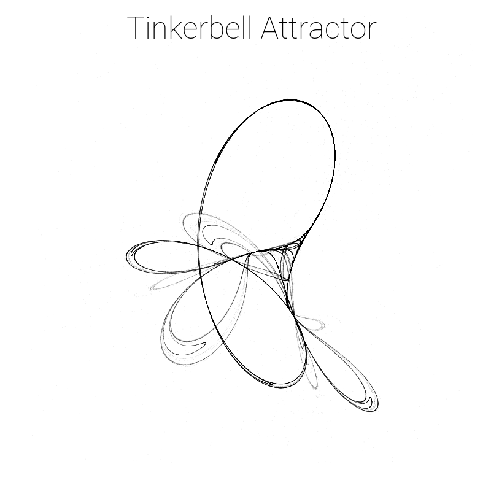
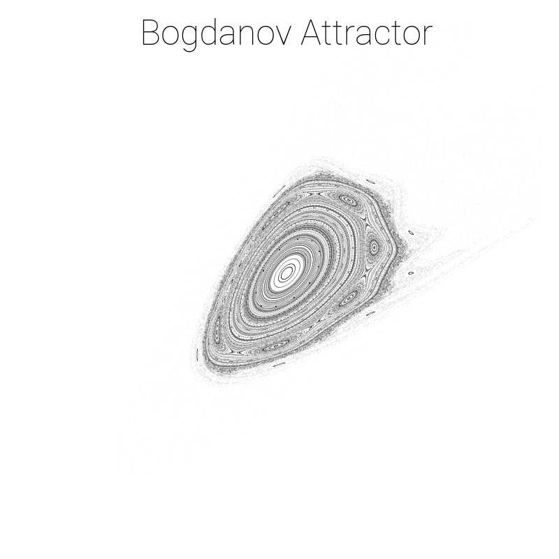

# Chaotic attractors


Python scripts to generate visualizations of two dimensional real discrete
chaotic attractors using [matplotlib](https://matplotlib.org/) and [numpy](https://numpy.org/).

## Samples







## PDF document generation

Requires installation of [pandoc universal document converter](https://pandoc.org/).

```
pandoc output.md -o output.pdf
```

## About

See [output.pdf](output.pdf) document for more information about the attractors.
