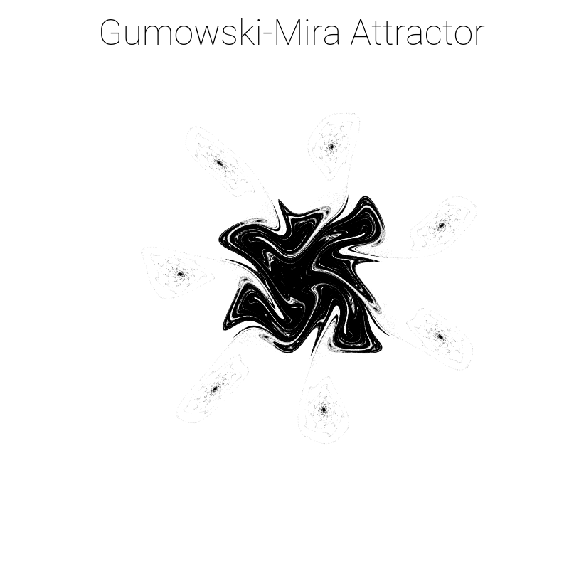

# Introduction

Showcase of a selection of two dimensional real discrete chaotic attractors.

\tableofcontents

\newpage

# Attractors

## Clifford attractor

$$x_{n+1}=\sin(ay_n)+c\cos(ax_n)$$
$$y_{n+1}=\sin(by_n)+d\cos(bx_n)$$

Image parameters:

$$a=2,b=-2,c=1,d=-1$$

## Peter de Jong attractor

$$x_{n+1}=\sin(ay_n)-\cos(bx_n)$$
$$y_{n+1}=\sin(cx_n)-\cos(dy_n)$$

Image parameters:

$$a=0.97,b=-1.899,c=1.381,d=-1.506$$

## Tinkerbell attractor

$$x_{n+1}=x_n^2-y_n^2+ax_n+by_n$$
$$y_{n+1}=2x_ny_n+cx_n+dy_n$$

Image parameters:

$$a=0.9,b=-0.6013,c=2,d=0.5$$

## Johnny Svensson attractor

$$x_{n+1}=d\sin(ax_n)-\sin(by_n)$$
$$y_{n+1}=c\cos(ax_n)+\cos(by_n)$$

Image parameters:

$$a=1.4,b=-1.56,c=1.4,d=-6.56$$

## Gumowski-Mira attractor

$$f(x)=ax+\frac{2(1-a)x^2}{(1+x^2)^2}$$
$$x_{n+1}=by_n+f(x_n)$$
$$y_{n+1}=f(x_{n+1})-x_n$$

Image parameters:

$$a=-0.192,b=0.982$$

## Fractal Dreams (SSSS) attractor

$$x_{n+1}=\sin(y_nb)+c\sin(x_nb)$$
$$y_{n+1}=\sin(x_na)+d\sin(y_na)$$

Image parameters:

$$a=1.468,b=2.407,c=0.194,d=1.438$$

## Quadratic Strange attractor

$$x_{n+1}=a_0+a_1 x_n+a_2 x_n^2+a_3 x_n y_n+a_4 y_n+a_5 y_n^2$$
$$y_{n+1}=a_6+a_7 x_n+a_8 x_n^2+a_9 x_n y_n+a_{10} y_n+a_{11} y_n^2$$

Image parameters:

$$CVQKGHQTPHTE$$

## Bogdanov attractor

$$x_{n+1}=x_n+y_{n+1}$$
$$y_{n+1}=y_n+\epsilon y_n+k x_n(x_n-1)+\mu x_n y_n$$

Image parameters:

$$\epsilon=0,k=1.2,\mu=0$$

## Gingerbread attractor

$$x_{n+1}=1-y_n+|x_n|$$
$$y_{n+1}=x_n$$

## Duffing attractor

$$x_{n+1}=y_n$$
$$y_{n+1}=-b x_n+a y_n-y_n^3$$

Image parameters:

$$a=2.5,b=1$$

## Hénon attractor

$$x_{n+1}=1-a x_n^2+y_n$$
$$y_{n+1}=b x_n$$

Image parameters:

$$a=1.2,b=0.5$$

## Ikeda attractor

$$t_n=0.4-\frac{6}{1+x_n^2+y_n^2}$$
$$x_{n+1}=1+u(x_n\cos t_n-y_n\sin t_n)$$
$$y_{n+1}=u(x_n\sin t_n+y_n\cos t_n)$$

Image parameters:

$$u=0.918$$

## Standard attractor

Values of $p$ and $\theta$ were replaced by $x$ and $y$ respectively.

$$p_{n+1}=[p_n+K\sin(\theta_n)]\mod{2\pi}$$
$$\theta_{n+1}=[\theta_n+p_{n+1}]\mod{2\pi}$$

Image parameters:

$$u=0.918$$

## Zaslavskii attractor

$$\mu=\frac{1-e^{-r}}{r}$$
$$x_{n+1}=[x_n+\nu(1+\mu y_n)+\epsilon\nu\mu\cos(2\pi x_n)]\mod{1}$$
$$y_{n+1}=e^{-r}(y_n+\epsilon\cos(2\pi x_n))$$

Image parameters:

$$\epsilon=1.5,\nu=0.8,r=1.2$$

# References

- https://sequelaencollection.home.blog/2d-chaotic-attractors/
- https://blbadger.github.io/
- https://en.wikipedia.org/wiki/List_of_chaotic_maps

\newpage

Attractor.png)

